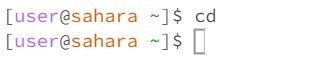
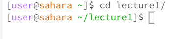
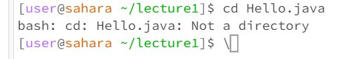
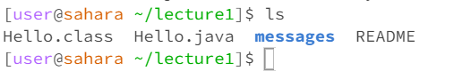
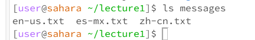
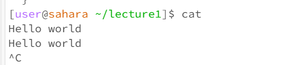
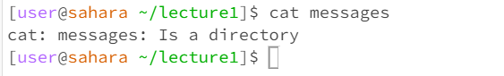
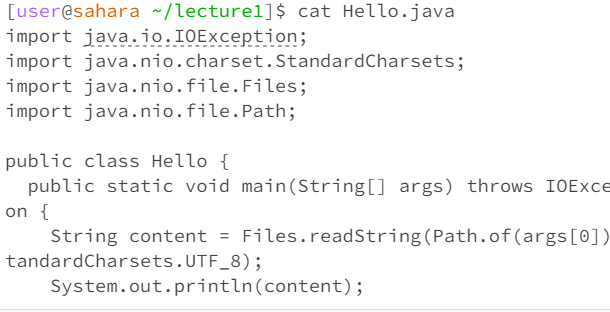

# For the command `cd`
## Num1
* Working directory was `root`
* Wasn't able to show it in the screenshot, but cd with no arguments will change the working directory to `root`
* The output was not an error, working as intended

## Num2

## Num3

# For the command `ls`
## Num1

## Num2

## Num3

# For the command `cat`
## Num1

## Num2

## Num3

