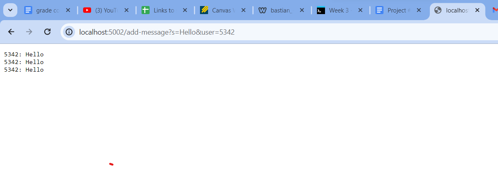
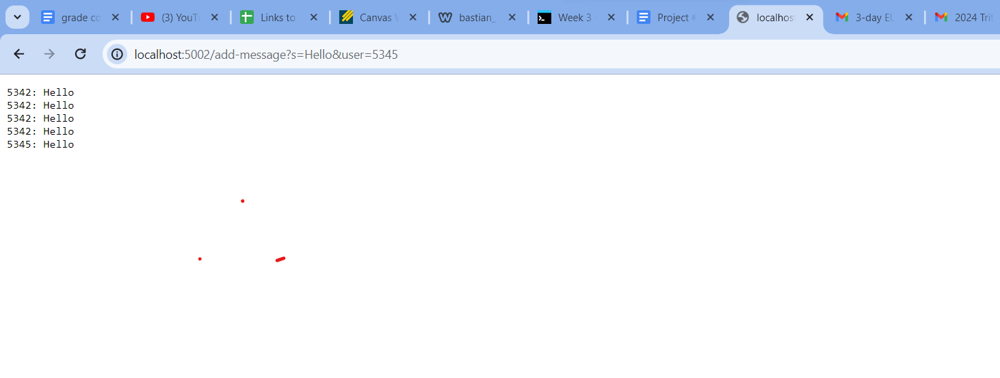
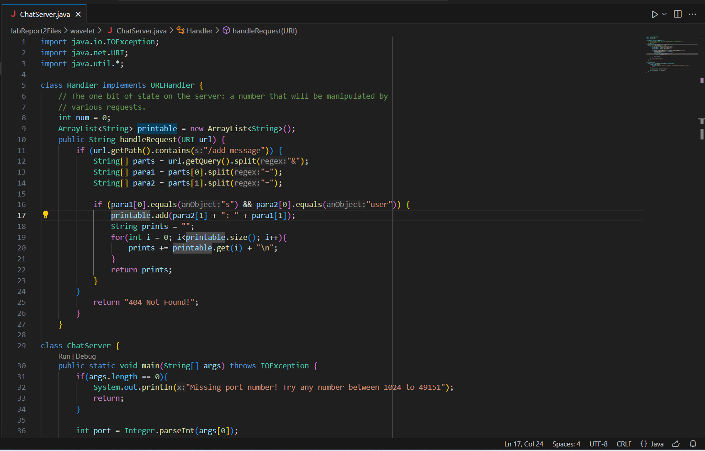
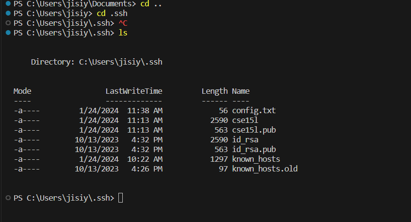
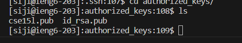

# Lab Report 2
## Part 1
* The main method for the ```ChatServer``` class and ```handleRequests``` for the URL handler
* the main method takes in an ```String[] args``` during compile, and ```handleRequests``` 
takes in the current ```URLhandler```. 
* ```args``` from the main function never change, and the ```url``` changes based on user
* the field I have for this class is ```ArrayList<String> printable``` that stores all the messages, printable adds the current chat message
inputs 

* like for the first screen shot, the main methods continues to run
* main takes in ```String[] args``` during compile and ```handleRequests``` fire now when I make a request with my url
* the field ```ArrayList<String> printable``` changes again now that I send a second request, it stores it as another string object


## Part 2
* ``C:\Users\jisiy\.ssh\id_rsa`` is the abosolute path of my private key to log into the system
* ``/home/linux/ieng6/oce/7g/siji/.ssh/authorized_keys`` is the absolute path of my public key to log into the system on the ieng6 side
* There was a problem with ssh and rsa key interaction when login into the ucsd computer, not able to complete, was told that it will be addressed later.





## Part 3
* I thought how setting up a webserver in java was interesting, since I have only been exposed to webdev in java script before.
