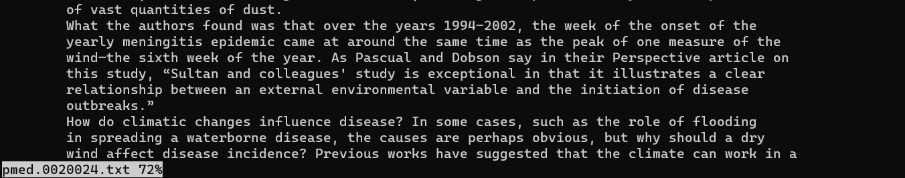

# Lab Report 3

## Bugs 
failure inducing input
```
    @Test
    public void testFilter(){
        List<String> input1 = new ArrayList<String>();
        input1.add("China");
        input1.add("china");
        input1.add("Mother");
        input1 = ListExamples.filter(input1, sc);
        assertEquals("Mother", input1.get(0)); //this is the line that created the failure
        assertEquals("Haha", input1.get(1)); 
    }
```
no failure
```
    @Test
    public void testFilter(){
        List<String> input1 = new ArrayList<String>();
        input1.add("China");
        input1.add("china");
        input1.add("Mother");
        input1 = ListExamples.filter(input1, sc);
        assertEquals("Mother", input1.get(0));
```
    
symptom


the bug is that it is adding the list at the beginning, causing the order to be reversed.
```
  static List<String> filter(List<String> list, StringChecker sc) {
    List<String> result = new ArrayList<>();
    for(String s: list) {
      if(sc.checkString(s)) {
        result.add(0, s);
      }
    }
    return result;
  }
```
fixed
```
  static List<String> filter(List<String> list, StringChecker sc) {
    List<String> result = new ArrayList<>();
    for(String s: list) {
      if(sc.checkString(s)) {
        result.add(s);
      }
    }
    return result;
  }
```

## Less

credits: https://phoenixnap.com/kb/less-command-in-linux

less with option -f : which forcifily opens non-regular files

```
less -f technical/
```
which returns
```
read error (press RETURN)
```
```
less -f government/
```
```
read error (press RETURN)
```
not a good respresentation given this file, but might be good for understand files of different formats that are not commonly accessable such as .exe. 

less with option -m: Instructs less to prompt verbosely (similar to more), showing the percentage into the file. By default, less prompts with a colon.

```
less -m pmed.0020024.txt
```


```
less -m 1471-230X-1-5.txt      
        Background & Aims
        MAdCAM-1 is a 60 kD endothelial cell adhesion mol
ecule
        expressed on the surface of high endothelial venu
les in the
        gut, and in Peyers patches. MAdCAM-1 is expressed
 basally
        in these tissues and is dramatically increased in
        inflammatory bowel disease (IBD). In IBD, especia
lly
        Crohn's disease, MAdCAM-1 acts as the main ligand
 for
        a4b7-expressing lymphocytes and recruits these ly
mphocytes
        into the intestine where they initiate and sustai
n chronic
        inflammation. Several animal models and human stu
dies
        support an absolute requirement for both MAdCAM-1
 and a4b7
        in the production of immune models of colitis. MA
dCAM-1 is
        expressed on the surface of lymphoid endothelial 
4%
```
useful or reading through long documents since you know how far in you are 

less with option -X: Disable clearing the screen after quitting less.

```
less -X 1471-230X-1-5.txt
```
After pressing q
```
230X-1-5.txt 

  
    
      
        Background & Aims
        MAdCAM-1 is a 60 kD endothelial cell adhesion mol
ecule
        expressed on the surface of high endothelial venu
les in the
        gut, and in Peyers patches. MAdCAM-1 is expressed
 basally
        in these tissues and is dramatically increased in
        inflammatory bowel disease (IBD). In IBD, especia
lly
        Crohn's disease, MAdCAM-1 acts as the main ligand
 for
        a4b7-expressing lymphocytes and recruits these ly
mphocytes
        into the intestine where they initiate and sustai
n chronic
        inflammation. Several animal models and human stu
dies
        support an absolute requirement for both MAdCAM-1
 and a4b7
        in the production of immune models of colitis. MA
[user@sahara ~/docsearch/technical/biomed]$ ^C
```
