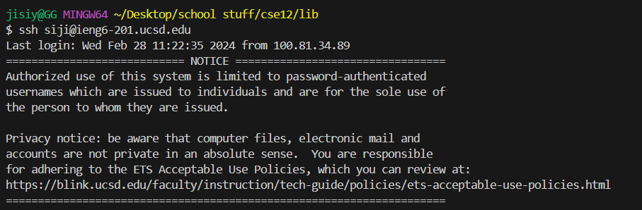
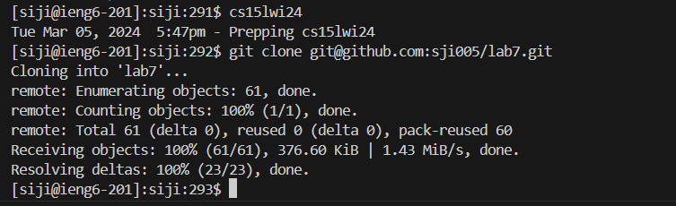
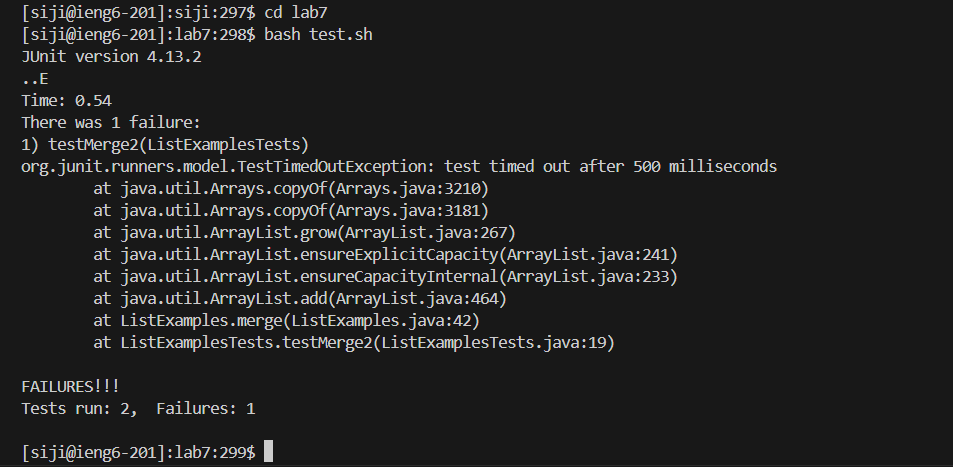
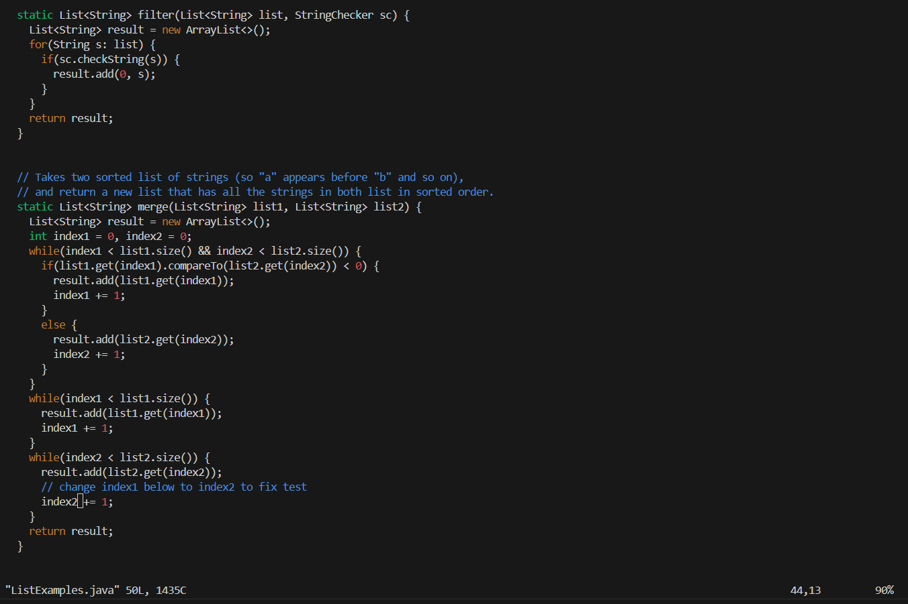
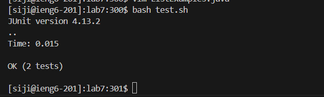
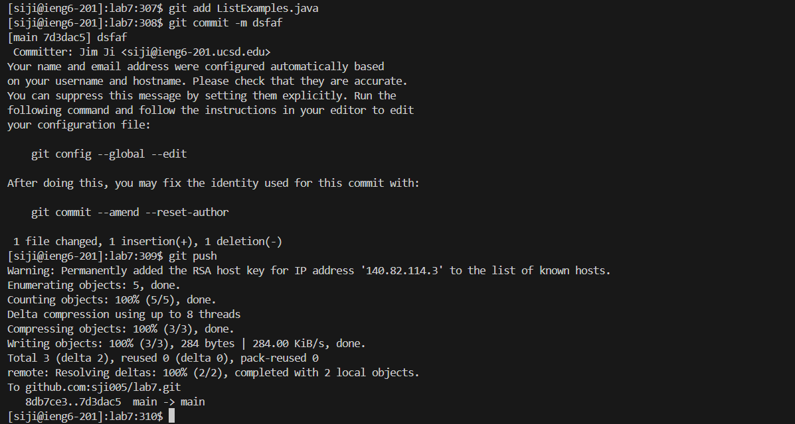

# Vim
## After forking the repository, on terminal
### Step 4 Logging in
- `ssh siji@ieng6-201.ucsd.edu` then `<enter>` logs into the ieng6 machine

### Step 5 Cloning my repo
- `cs15lwi24` then `<enter>` to go to cs15l environment
- `git clone git@github.com:sji005/lab7.git` then `<enter>` clones repository to ieng machine
  
### Step 6 Going to directory and running tests
- `cd lab7` then `<enter>` changes directory to lab7
- `bash test.sh` then `<enter>` runs the initial test and let us know that something was wrong with the code

### Step 7 Editing the code to fix the bug
- `vim ListExamples.java` then `<enter>` vims into ListExamples
- `44G, dw, I, index2 , esc, :wq` then `<enter>` `44G` goes to the 44th line which was the line we need to change, `dw` deletes the word index1, `i` goes into insert mode, `index2` modifies it to the correct one, `esc` goes into normal mode, `:wq` saves and quits `vim`

### Step 8 Running the tests
- `up arrow, up arrow <enter>` goes to the 2nd most recent command which runs the `test.sh` file, this time it should return with no errors

### Step 9 pushing the files back to github 
- `git add ListExamples.java <enter>` puts the `ListExamples.java` into the list of files waiting to be commited
- `git commit -m sdkjfslk <enter>` commits the file with a random message
- `git push <enter>` push the file into the github git repository

